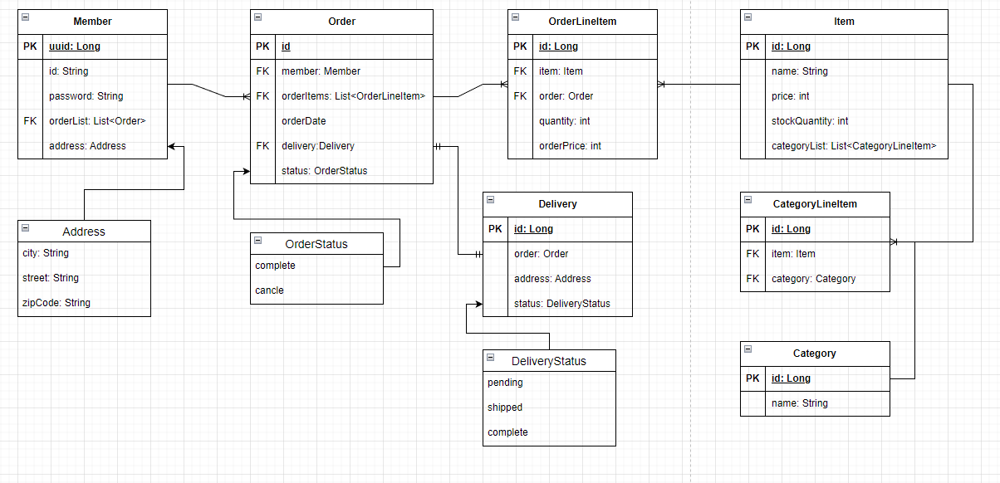
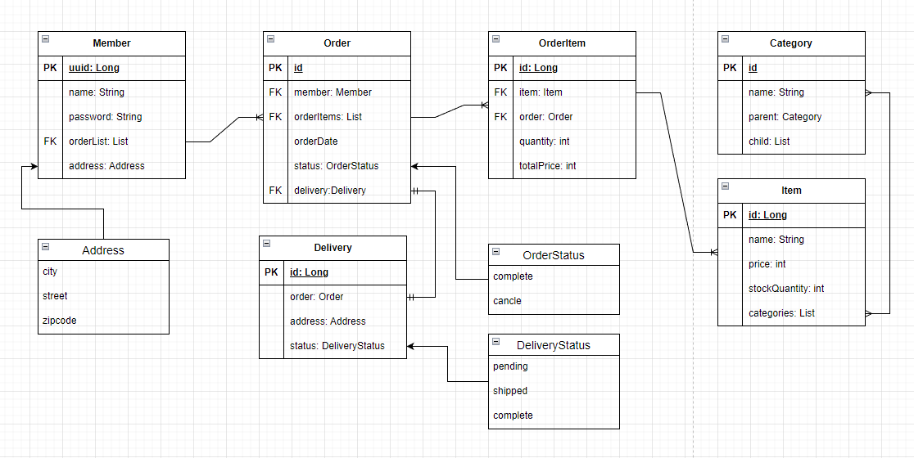

1. Design
2. Impl
3. Refactoring
4. Monitoring

# ToyProject-Platform
## Goal
이커머스 플랫폼을 제로 베이스부터 구축 해본다. 

아키텍처를 먼저 생각하는 것이 아니라 비지니스를 위한 기능을 먼저 생각한다. 
기능이 점차 추가됨에 따라 리팩터링한다.

# 첫 번째 목표
1. 회원 가입을 할 수 있다.
2. 로그인을 할 수 있다.
3. 상품을 등록 및 취소할 수 있다.
4. 상품을 주문할 수 있다.

---
domain: 도메인 모델을 정의한다.
infrastructure: db 및 외부 API 연결을 담당한다.
usecase: 비지니스 로직
web: 웹 레이어